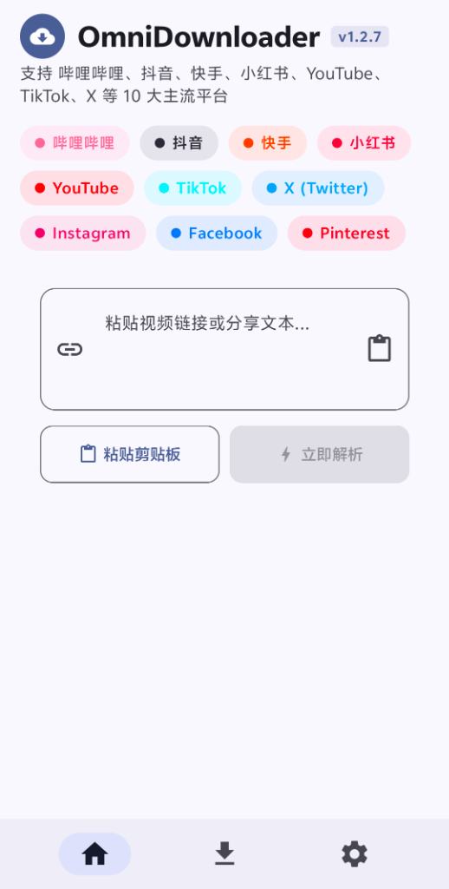

<div align="center">

# OmniDownloader (全能音视频下载器)

<p>
  <a href="README.md">English</a> •
  <a href="README_ZH.md">简体中文</a> •
  <a href="README_ZH_TW.md">繁體中文</a> •
  <a href="README_JA.md">日本語</a>
</p>

[](https://github.com/baishu136/OmniDownloader/releases)
[](https://developer.android.com)
[](https://kotlinlang.org)
[](https://developer.android.com/jetpack/compose)
[](LICENSE)

专为 Android 平台打造的现代化原生多媒体下载利器。基于 **Jetpack Compose (Material 3)** 构建，底层内嵌工业级 **yt-dlp**、**FFmpeg** 与 **Aria2c** 原生引擎，支持 10 大主流平台的音视频高效解析与下载。

<br />



</div>

---

## 🌟 核心特性

### 1. 🌐 10+ 主流媒体平台全方位支持
- **国内平台深度定制**：
  - **哔哩哔哩 (Bilibili)**：支持常规视频、多 P 分集视频、系列合集、番剧；自动还原手机端 `b23.tv` 短链；原生 Dash 音视频分离流合并。
  - **抖音 (Douyin)**：支持分享口令与短链解析，自动重定向嗅探无水印视频流。
  - **快手 (Kuaishou)**：一键嗅探短视频直链。
  - **小红书 (Xiaohongshu)**：支持笔记视频解析。
- **国际主流媒体全面覆盖**：
  - **YouTube**：支持普通视频、Shorts 短视频，最高支持 4K/2K/1080P 超高清流。
  - **TikTok**：支持全球版视频无水印解析。
  - **X (Twitter)**：支持推文附带的各种分辨率视频流。
  - **Instagram**：Reels 与帖子视频。
  - **Facebook**：公开视频与短视频。
  - **Pinterest**：高品质灵感视频。

### 2. 🎬 灵活的下载模式选择
| 下载模式 | 功能说明 | 技术实现 |
| :--- | :--- | :--- |
| **音画合流** | 自由挑选目标分辨率（4K / 1080P / 720P / 480P），提供文件预估大小 | 自动挑选最佳画质轨与最佳音轨，调用内置 FFmpeg 无缝合并为 MP4 |
| **纯视频画面** | 剥除音频轨道，仅下载纯净画面（适合剪辑二创素材） | 原生注入 `-an` 参数去除声轨，免除二次消音处理 |
| **提取音频** | 抽取并转码高品质独立音频文件 | 支持导出为 **MP3**、**M4A (AAC)**、**FLAC (无损)**、**OPUS**，自动注入标题元数据 |
| **动态图 (GIF)** | 将视频精彩片段转换为轻量动态图 | FFmpeg 调优调色板生成高质量 GIF |
| **保存高清封面** | 独立可开关选项，随视频下载或一键单独保存 | 自动下载视频高清缩略图并直接同步至系统相册 |

### 3. 📦 智能合集与多视频防误触机制
- **合集智能识别**：使用“粘贴剪贴板”时，若链接为合集（如 B站多 P 视频、番剧、系列资源），**系统自动拦截直接下载**，弹出下载选项弹窗供用户自主决定。
- **自主勾选与批量管理**：
  - 支持直接在单集模式下横向预览各集并指定下载；
  - 支持一键切换为「合集模式」，提供每集复选框、一键「全选」与「反选」，自主勾选所需分集进行批量下载。

### 4. 🚀 强大的后台服务与系统集成
- **前台常驻服务 (Foreground Service)**：锁屏或切换到后台时下载不中断，通知栏实时反馈传输百分比、下载速度与预估剩余时间。
- **多语言国际化**：内置简体中文、繁體中文、English、日本語 4 种语言，默认智能跟随系统语言并支持随时在设置中切换。
- **公共存储与相册自动同步**：符合 Android 分区存储规范，下载完成即时触发系统媒体库扫描，相册与播放器即刻可见。
- **网络代理支持**：支持配置 HTTP 与 SOCKS5 代理端口，便于解析访问外网资源。
- **在线引擎热更新**：设置内支持一键在线更新底层 yt-dlp 规则引擎，平台规则变更时无需重新安装应用。

---

## 📲 快速下载安装

您可以前往 [Releases 页面](https://github.com/baishu136/OmniDownloader/releases) 下载最新的安装包：

- 📦 **`OmniDownloader-v1.2.7-debug.apk`**：最新 Android 安装包（支持 Android 8.0 及更高版本，arm64-v8a 架构）。
- 📦 **`OmniDownloader-v1.2.7-Source.zip`**：完整工程纯净源码压缩包。

---

## 🛠️ 技术架构

- **开发语言**：Kotlin 1.9.23
- **构建系统**：Gradle 8.5 + AGP 8.3.2
- **界面架构**：Jetpack Compose + Material Design 3
- **架构设计**：MVVM (Model-View-ViewModel) + Clean Architecture
- **异步响应**：Kotlin Coroutines + StateFlow
- **解析与音视频引擎**：
  - `io.github.junkfood02.youtubedl-android:library:0.18.1` (yt-dlp)
  - `io.github.junkfood02.youtubedl-android:ffmpeg:0.18.1` (FFmpeg)
  - `io.github.junkfood02.youtubedl-android:aria2c:0.18.1` (Aria2c)
- **网络与嗅探**：Square OkHttp 4.12.0
- **图片加载**：Coil Compose 2.6.0

---

## 💻 源码编译指南

如果您想自行编译和二次开发：

```bash
# 1. 克隆仓库
git clone https://github.com/baishu136/OmniDownloader.git
cd OmniDownloader

# 2. Windows 环境下编译 Debug APK
.\gradlew.bat assembleDebug --no-daemon

# 3. macOS / Linux 环境下编译
chmod +x ./gradlew
./gradlew assembleDebug --no-daemon
```

编译生成文件位于：`app/build/outputs/apk/debug/app-debug.apk`。

---

## 📄 开源许可证

本项目基于 [MIT 许可证](LICENSE) 开源。仅供个人学习、技术研究与离线备份使用，请严格遵守各平台服务协议与版权法规。
